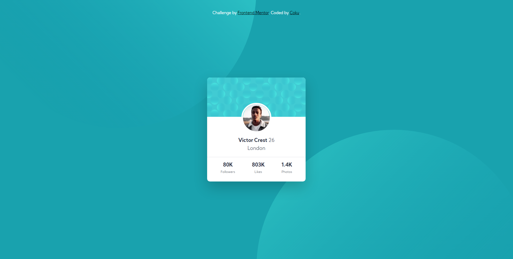

# Frontend Mentor - Profile card component solution

This is a solution to the [Profile card component challenge on Frontend Mentor](https://www.frontendmentor.io/challenges/profile-card-component-cfArpWshJ). Frontend Mentor challenges help you improve your coding skills by building realistic projects. 

## Table of contents

- [Overview](#overview)
  - [The challenge](#the-challenge)
  - [Screenshot](#screenshot)
  - [Links](#links)
- [My process](#my-process)
  - [Built with](#built-with)
  - [What I learned](#what-i-learned)
- [Author](#author)

**Note: Delete this note and update the table of contents based on what sections you keep.**

## Overview

### The challenge

- Build out the project to the designs provided

### Screenshot

### Links

- Solution URL: [Add solution URL here](https://your-solution-url.com)
- Live Site URL: [(https://mrcoku.github.io/profile-card-component/)]

## My process

### Built with

- CSS custom properties
- Flexbox
- Mobile-first workflow

### What I learned

Position property and font weight.

## Author

- Website - [Coku]
- Frontend Mentor - [MrCoku](https://www.frontendmentor.io/profile/MrCoku)
- Twitter - [@coku_mr](https://twitter.com/coku_mr)

